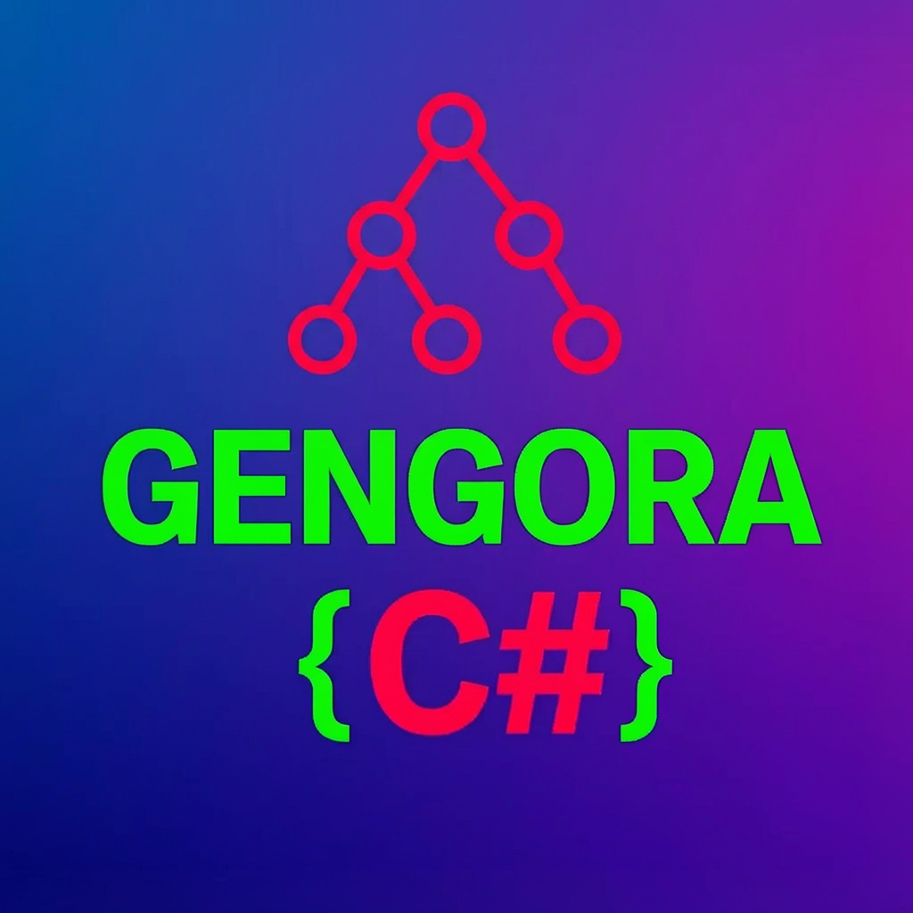

# Gengora - Live Code Generation for VS Code

[](CHANGELOG.md)
[](LICENSE)
[](https://code.visualstudio.com/)

**Gengora** enables live code generation with hot-reload support for .NET projects. Write your code generators in C# and see generated code update automatically as you edit.



## Features

- 🔥 **Hot-Reload** - Generators recompile and re-run automatically when source files change
- 📊 **Status Bar Integration** - Real-time feedback on generator state with clickable menu
- 🔍 **Auto-Discovery** - Automatically detects generator projects in your workspace
- 📝 **Diagnostic Reporting** - Compilation errors displayed in VS Code
- 🎯 **Type-Safe Development** - Includes abstractions library for generator authors

## Quick Start

### 1. Create a Generator Project

Create a new .NET console application and add the marker to your `.csproj`:

```xml
<Project Sdk="Microsoft.NET.Sdk">
  <PropertyGroup>
    <OutputType>Exe</OutputType>
    <TargetFramework>net8.0</TargetFramework>
    <IsGeneratorProject>true</IsGeneratorProject>
  </PropertyGroup>
</Project>
```

### 2. Write Your Generator

```csharp
using System.Text.Json;

var sessionId = Environment.GetEnvironmentVariable("GENGORA_SESSION_ID") 
    ?? Guid.NewGuid().ToString("N");

// Report start
Console.WriteLine(JsonSerializer.Serialize(new {
    type = "generator/status",
    action = "start",
    message = "Generator starting",
    session_id = sessionId,
    timestamp = DateTimeOffset.UtcNow.ToString("O")
}));

// Generate your code...
var outputPath = "Generated/MyClass.cs";
await File.WriteAllTextAsync(outputPath, "// Generated code");

// Report file emission
Console.WriteLine(JsonSerializer.Serialize(new {
    type = "generator/file",
    action = "emit",
    path = Path.GetFullPath(outputPath),
    session_id = sessionId,
    timestamp = DateTimeOffset.UtcNow.ToString("O")
}));

// Report completion
Console.WriteLine(JsonSerializer.Serialize(new {
    type = "generator/status",
    action = "complete",
    message = "Done!",
    session_id = sessionId,
    timestamp = DateTimeOffset.UtcNow.ToString("O")
}));
```

### 3. Open in VS Code

Open the folder containing your generator. Gengora will:

1. ✅ Discover the generator project
2. ✅ Compile it with Roslyn
3. ✅ Execute it
4. ✅ Watch for file changes
5. ✅ Hot-reload when you make changes

## Status Bar

Click the Gengora status bar item for quick access to:

- 📤 **Show Output** - View logs and diagnostics
- ▶️ **Start/Stop Server** - Control the language server
- 🔄 **Recompile Generator** - Force recompilation
- 🔁 **Restart Server** - Restart the language server
- ⚙️ **Set Log Level** - Change logging verbosity

## Commands

| Command | Description |
|---------|-------------|
| `Gengora: Show Commands` | Open the command menu |
| `Gengora: Start Server` | Start the language server |
| `Gengora: Stop Generator` | Stop the current generator |
| `Gengora: Recompile Generator` | Force recompilation |
| `Gengora: Restart Server` | Restart the language server |
| `Gengora: Show Output` | Show output channel |
| `Gengora: Set Log Level` | Change log verbosity |

## Configuration

| Setting | Type | Default | Description |
|---------|------|---------|-------------|
| `gengora.serverPath` | string | "" | Path to custom language server |
| `gengora.logLevel` | string | "info" | Log verbosity (trace/debug/info/warning/error) |
| `gengora.autoStart` | boolean | true | Auto-start on workspace open |

## Generator State Machine

```
Idle → GeneratorFound → Compiling → Ready ↔ Running
                           ↑          |
                           └── Error ←┘
```

## Sample Projects

The extension includes sample generator projects in the `samples/` folder:

- **BasicGenerator** - Minimal working example with full documentation
- **Gengora.Generator.Abstractions** - Type-safe library for generator development

## Use Cases

- 📦 Generate boilerplate code (CRUD, repositories, DTOs)
- 🔧 Create configuration classes from JSON/YAML
- 🌐 Build API clients from OpenAPI specifications
- 📚 Generate documentation from code
- 🧪 Create test fixtures and mocks
- 🗄️ Generate entity classes from database schemas

## Requirements

- Visual Studio Code 1.85 or higher
- .NET 8.0 SDK or higher
- Windows, macOS, or Linux

## Extension Size

This extension is optimized for minimal footprint:
- **Extension Package**: ~150 KB (TypeScript/JavaScript)
- **Language Server**: ~5 MB (bundled .NET assembly)
- **Total**: ~5-6 MB

## Known Issues

- Single generator project support per workspace (v1 limitation)
- Single workspace root support
- Requires MSBuild SDK to be properly configured

## Release Notes

### 0.4.0

- Added status bar click menu with all commands
- Added Start, Restart, and Set Log Level commands
- Added sample generator projects
- Added Gengora.Generator.Abstractions library
- Improved extension packaging and documentation
- Various bug fixes and stability improvements

See [CHANGELOG](CHANGELOG.md) for full history.

## Contributing

Contributions are welcome! Please visit our [GitHub repository](https://github.com/blue-it-systems/bits.vscode).

## Support

- 📖 [Documentation](https://github.com/blue-it-systems/bits.vscode/tree/main/gengora)
- 🐛 [Report Issues](https://github.com/blue-it-systems/bits.vscode/issues)
- 💬 [Discussions](https://github.com/blue-it-systems/bits.vscode/discussions)

## License

MIT License - © 2024 Blue IT Systems GmbH

**Important Notice**: This software may contain automatic code generation and/or code modification features. Use at your own risk. The licensor (Blue IT Systems GmbH) assumes no liability for damages, data loss, malfunctions, or security breaches arising from the use, modification, or results of this software.

---

Made with ❤️ by [Blue IT Systems GmbH](https://blue-it-systems.de)
